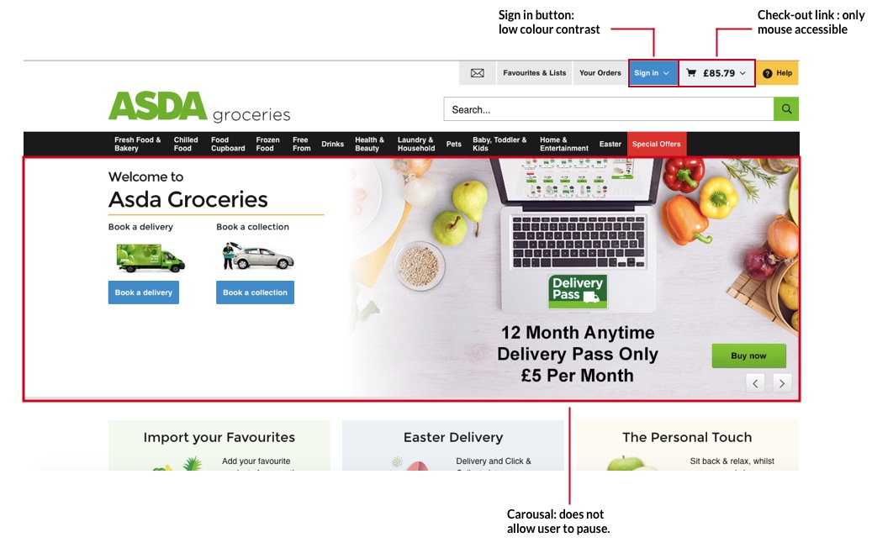
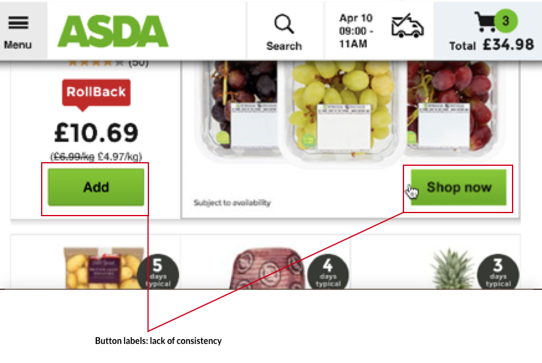
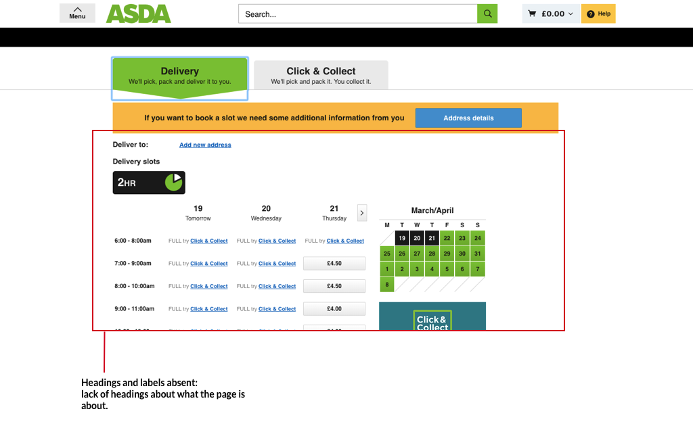
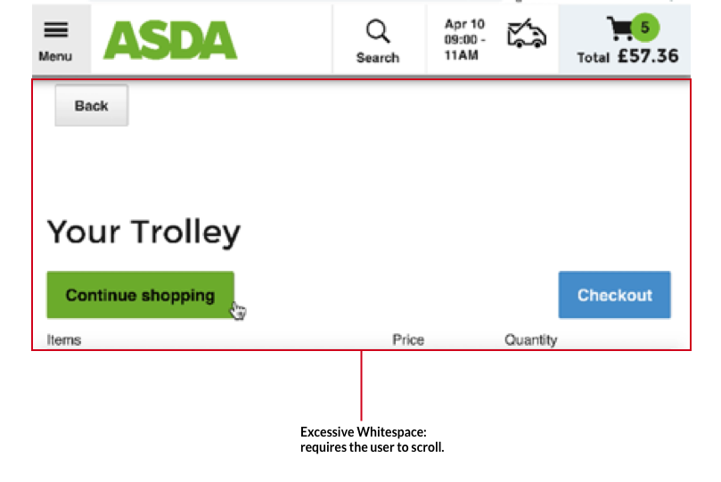
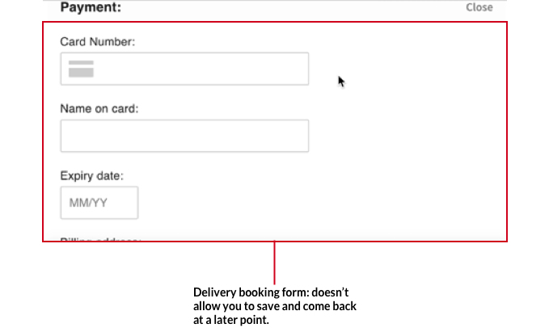

To begin, a user journey was selected to limit the scope of the audit and to ensure that a key part of the site for the business was tested. A key task for customers using this site is to book a delivery slot so users can receive their purchases. Therefore the following user journey was selected:

“You are buying groceries for a dinner party you are organizing. Order the items to your home so that it arrives tomorrow at 3pm.”

The audit was carried out with a combination of automated tools and manual testing to ensure a detail throrough review.

(1) Empathic modelling

Empathy modelling is a technique that allows you to put yourself in the position of someone with a disability.  It works by simulating an impairment. I did this by placing buttons on the joints of my hand and then sellotaping the buttons into place. The restrictors would cause pain as I moved my hands mimicking the experience of someone who had arthritis as they moved their joints. I also zoomed in to the website by 200% as I completed the user journey.

Both of these enactments would help me to empathise with older users who may have arthiritus. I chose to enact the experience of the elderly because it is this group that is likely to find home deliveries as essential.

(2) A manual audit carried out with the heuristics written by Deque and WCAG 2.1.

The Deque heuristics list helped me find common accessibility problems, whilst WCAG 2.1 has a longer more detailed list of guidelines. An example of some of the steps carried out is ensuring that alternative text were provided in links, completing the user journey with voice-over on and the screen turned off, and using only the keyboard to access the site.

(3) Automated test using the chrome DevTool called aXe

This tool was created by Deque and it helped pick up the accessibility issues that can be missed during a manual audit.

The homepage for ASDA's grocery website has a few issues when it comes to accessability. The sign in button does not have a sufficient contrast ratio, this makes it difficult for users who are colour-blind to read the text. To ensure compliance, they should use at least 4.5:1 for small text or 3:1 for large text.

The moving carousal on the homepage violates a Deque heuristic because it does not include a pause functionality. Content that moves or auto-updates by itself can be a barrier to anyone who has trouble reading stationary text quickly as well as anyone who has trouble tracking moving objects. It can also cause problems for screen readers.

The third problem with the homepage is that the check-out button cannot be accessed using a keyboard. This means that users who are Blind cannot use their keyboards to click on the checkout. 

Furthermore, there were two buttons which did the same thing but had different labels meaning the predicatability and consistency heuristic were violated. For users using screen readers this causes confusion.

Once you have finished shopping, you are taken to a calendar page to book your delivery. This page does not include a header or a description of what the page is about. For screen readers, who cannot see the calendar, they do not have the visual context so it is hard for them to make sense of the content of this page. 

Now for the page that allows users to book their delivery. On this page, there is a lot of whitespace used which means the user will have to frequently scroll to carry out a task. For users with arthiritis it causes pain when moving the joints in their finger, the website should minimize whitespace. 

When a user is filling in their personal details for the booking, the site does not allow users to save what they have already filled out so that they can come back later. We know that some users of the site may get tired whilst filling out forms so it's useful when possible to allow them to do so.