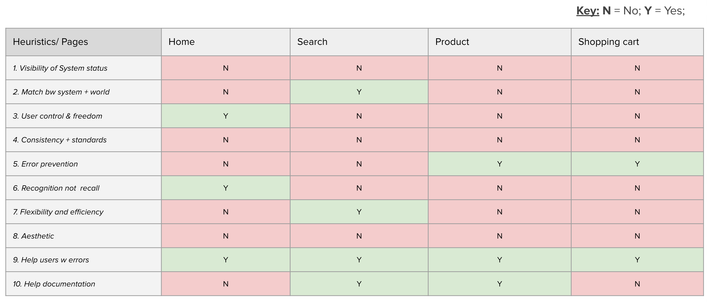
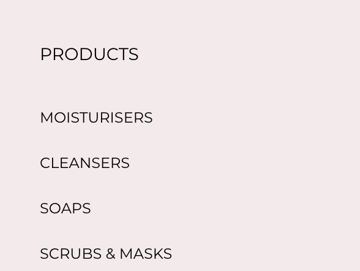

I ran a heuristic evaluation using Jakob Nielsen's 10 general principles for interaction design. They are called 'heuristics' because they are broad rules of thumb and not specific usability guidelines. A heuristic evaluation was used to predict areas of the website where users may struggle to achieve their goals. Ensuring your website is usable is key to growth, user retention and user satisfaction.

Conatural is an eccomerce website which sells beauty items. 

The heuristic audit on Conatural found 54 violations of UX best practice. The shopping cart page violated most of the usability heuristics. 

Visibility of system status (4/4 pages failed)

The system should always keep users informed about what is going on, through appropriate feedback within a reasonable time. However, there are many links including the navigation, where when the user hovers over them, there is no visual feedback for the user telling them that this is a link. When a heuristic is violated inside the navigation it can be really bad for the entire website because the navigation is often the section of the website that is repeated on every page. 
  

Match between system and real world (3/4 pages failed)

When this is done well, the system, should match the users language. Unfamiliar terms or interfaces may confuse users and make them second guess themselves. Listed in the navigation under the 'solution for' heading is 'pigmentation'. From observations and interviews with participants who are interested in skincare they would refer to darkened skin as hyperpigmentation rather than pigmentation. Hyperpignmentation is also the correct term for what is being described.

User control and freedom (3/4 pages failed)

Ensuring users have control and freedom means a website should support redo and undo.When navigating a site, users may sometimes make mistakes and it shouldn't be a hassle to reverse these actions. On the quick shop pop-up when users add an item to their basket, there is no button for them to 'undo'.

Consistency and standards (4/4 pages failed)

With this heuristic we should ask, are there instances where the system does not follow industry or platform conventions? Does the current page follow the same consitency standards of other page? It is known that users come an understanding of how to use your website based on previous experience, when you violate these norms you are forcing them to learn from scratch rather than buildng on the knowledge they already have. 

The website includes 'new in' and 'best sellers' in the navigation list at the bottom of the list whereas typically for e-commerce websites they are included as the first list items or 'new in' is included as its own navigation item.

Error prevention (2/4 pages failed)

Here we are asking if there are reasonable attempts made to prevent users from making errors. And when these errors do happen is ther ea way to recover from them? The website failed this heuristic as it doesn't prevent the user from searching for a product the site doesn’t sell.

The search functionality does not do anything to prevent the user from searching for a product the site doesn’t sell.

Recognition rather than recall  (3/4 pages failed)
The website should allow the user to rely on recognition rather recall to ease the cognitive load. In Conatural's product page, when a user adds multiple items into their cart, it does not provide a subtotal for them in the same page. Also, when an item comes in different sizes, the user has use a drop down to select an item in each size before the price. 

Flexibility and efficiency of use  (3/4 pages failed)

Shortcuts for advanced users allow them to speed up their interaction with your website. Conatural could improve its design by allowing users to have a wish list where they save items and come back for it at a later point.  

Aesthetic and minimalist design (4/4 pages failed)

At the times the use of images under text make the site seem cluttered and sometimes the text not readable. 

Help and documentation  (2/4 pages failed)

When users need help it is not clear the channels they need to take to get help. In the footer, although it provides a 'contact us' and 'FAQ link' there is no organization and these functions are mixed with all the other footer links. Clear and separate columns would have helped. If there was a heading that said "help and support" or "help and information" which had the links of the channels the users could use to get help, the website would have provided a self-explanatory way of receiving help.

